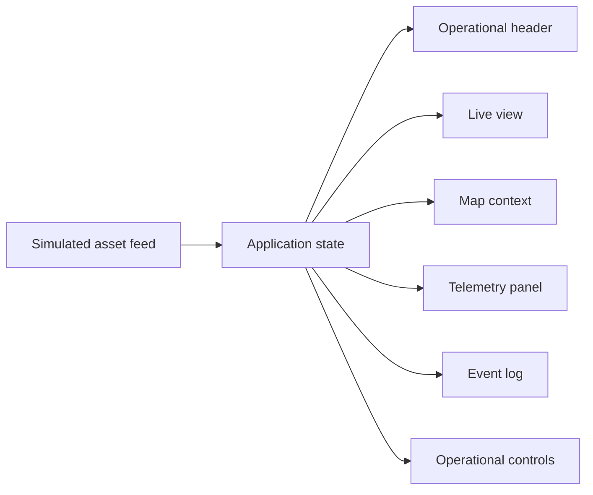

# UGV Operational Monitoring Interface

A TypeScript dashboard prototype for viewing simulated operational data, telemetry, event streams, and selected asset details.

## What it demonstrates

The project uses React, TypeScript, Vite, Tailwind CSS, and a client-side data simulation to create an interactive monitoring interface. The user interface separates live views, map context, telemetry, events, and operational controls so each concern can evolve independently.

## Architecture



The simulation produces assets and events. Application state selects the active asset and supplies focused data to the individual interface panels.

## Local development

```bash
npm ci
npm run dev
```

Run the checks before a pull request:

```bash
npm run lint
npm run build
```

## Project standards

Contributor guidance and GitHub Actions keep change expectations explicit and verify the production build for every push and pull request.
